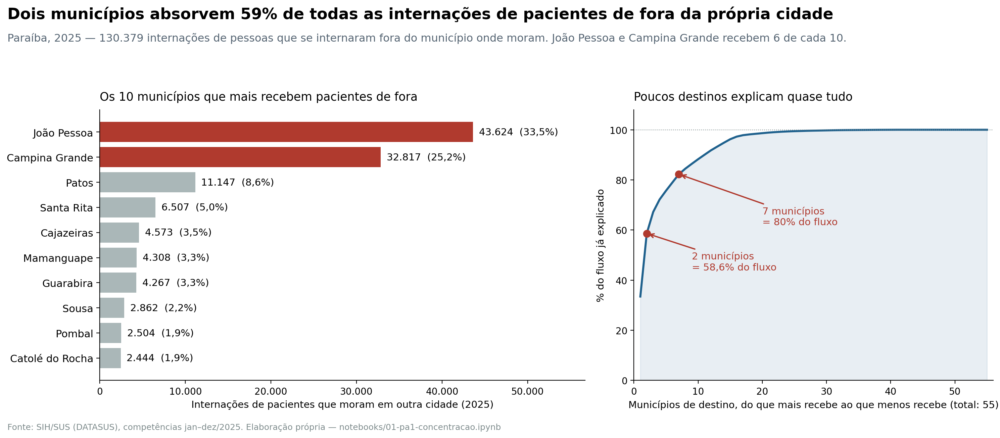
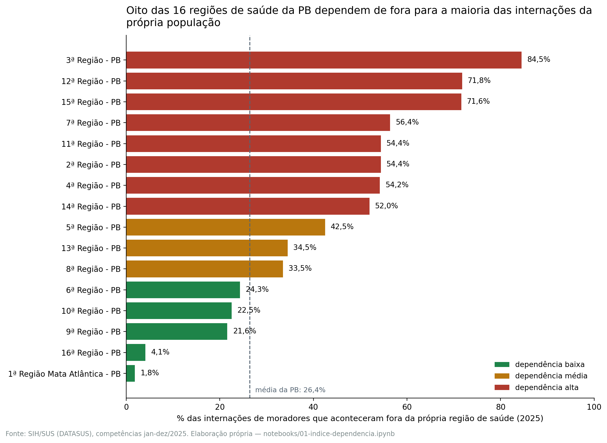
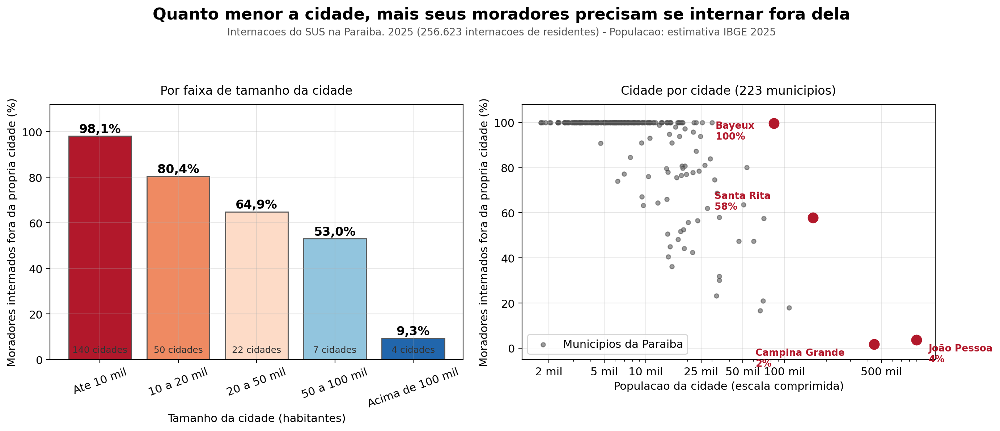
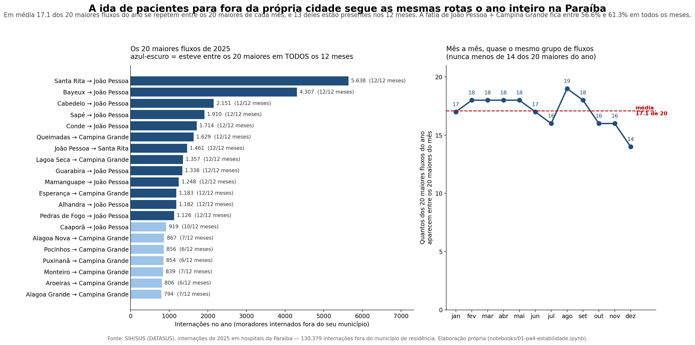
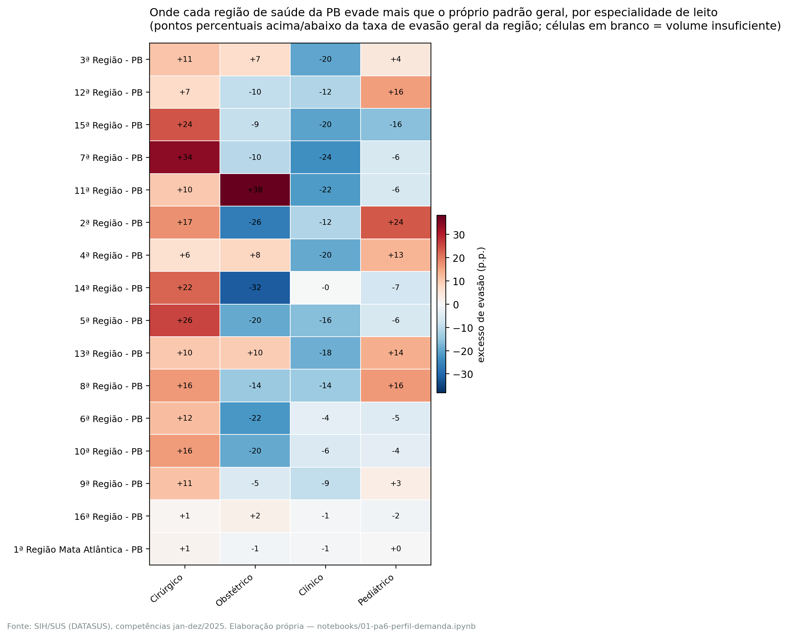

# Mapa de Evasão Assistencial da Paraíba

### Para onde vai quem precisa se internar? Matriz Origem → Destino e índice de dependência das regiões de saúde da Paraíba (SIH/DATASUS, 2025)

**Disciplina:** Análise de Dados — UFPB, 2026.1

**Autores:** Augusto Blois · Pedro Luna

**Data:** 7 de agosto de 2026

**Painel interativo:** https://projeto-saude-pb.streamlit.app

**Repositório:** https://github.com/augustoblois/projeto-saude-pb

---

## 1. Introdução e problema

Quando um morador da Paraíba precisa de uma internação hospitalar, ele nem sempre consegue um leito na cidade onde vive. Às vezes isso é esperado — uma cirurgia cardíaca complexa deve mesmo ser feita em hospital de referência, com equipe treinada e volume suficiente para manter a qualidade. Outras vezes não: é um parto, uma pneumonia, uma apendicite que poderiam ter sido resolvidos perto de casa e não foram, porque não havia onde.

A diferença entre esses dois casos é a diferença entre uma rede de saúde funcionando como projetada e uma rede com buracos. **E essa diferença não está visível em nenhum painel público brasileiro.**

O SUS organiza o planejamento hospitalar em **regiões de saúde** — agrupamentos de municípios que, em tese, devem ser capazes de atender conjuntamente a maior parte das necessidades da sua população. A Paraíba tem 16 dessas regiões. O instrumento pelo qual os municípios formalizam quem atende quem, e com que recurso, é a **Programação Pactuada e Integrada (PPI)**. Para dimensionar essa pactuação, o gestor precisaria saber quantos pacientes saem de cada lugar, para onde vão, e por quê.

Essa informação existe no dado bruto do DATASUS, mas não existe como produto consultável. Os painéis públicos do SIH/SUS (TabNet e derivados) permitem contar internações **por município de internação** ou **por município de residência** — separadamente. O cruzamento dos dois, que é o que revela o **fluxo**, exige baixar e tratar a base. Na prática, o gestor estadual decide regionalização e PPI sem enxergar o caminho que o paciente de fato percorre.

**O problema que este trabalho enfrenta**, então, é duplo: (a) medir a evasão assistencial hospitalar da Paraíba — quanto dela existe, de onde sai, para onde vai; e (b) separar, dentro dessa evasão, o deslocamento clinicamente justificado daquele que denuncia ausência de serviço local — porque os dois exigem políticas públicas opostas.

O achado que abre o trabalho dá a dimensão da coisa: **em 2025, metade das internações realizadas na Paraíba (50,5%) foi de pacientes que tiveram de sair do próprio município.**

## 2. Objetivos


**Objetivo geral.** Construir e publicar uma ferramenta que torne visível o fluxo hospitalar intraestadual da Paraíba, em formato utilizável por um gestor real da Secretaria Estadual de Saúde para decisões de regionalização e pactuação.


**Objetivos específicos:**


| # | Objetivo | Critério de verificação |
|---|---|---|
| O1 | Produzir a matriz origem→destino das internações da PB em 2025 | Cobertura dos 12 meses; soma dos pares (origem, destino) igual à contagem bruta da base |
| O2 | Definir e calcular um índice de dependência por região de saúde | Índice para 100% das 16 regiões, com fórmula escrita e compreensível por leitor não-técnico em uma leitura |
| O3 | Caracterizar o deslocamento — separar referência legítima de evasão evitável | Cada internação evadida classificada individualmente, com regra declarada e reprodutível |
| O4 | Derivar recomendações acionáveis para a SES-PB | Toda recomendação ancorada em um número rastreável até o notebook que o calcula |
| O5 | Garantir reprodutibilidade ponta a ponta | `git clone` + instalação de dependências + `streamlit run` reproduz o painel sem depender de fonte viva |
| O6 | Publicar o painel em acesso público | URL aberta, sem exigência de login |

O objetivo O5 merece uma palavra, porque condicionou decisões de engenharia ao longo de todo o projeto: o servidor FTP do DATASUS é instável e a publicação dos dados é feita em lotes mensais com cerca de dois meses de atraso. Um produto que consultasse a fonte ao vivo seria mais frágil e não seria mais atual. Por isso **todos os dados foram congelados em arquivos locais versionados** — o painel funciona com a máquina desconectada da internet.


## 3. Fontes de dados utilizadas

### 3.1 Base principal — SIH/SUS

**Sistema de Informações Hospitalares do SUS (SIH/SUS)**, mantido pelo DATASUS, grupo **RD (AIH Reduzida)**.

| Atributo | Valor |
|---|---|
| Acesso | FTP direto do DATASUS (`ftp.datasus.gov.br/dissemin/publicos/SIHSUS/200801_/`) |
| Arquivos | `RDPB2501` a `RDPB2512` (Paraíba, jan–dez/2025) |
| Formato de origem | `.dbc` (formato comprimido proprietário do DATASUS) |
| Formato de trabalho | Parquet, versionado no repositório |
| Volume | **258.125 internações**, 118 colunas |
| Unidade de registro | AIH — Autorização de Internação Hospitalar |

A unidade de registro importa para toda leitura do trabalho: **uma linha é uma internação autorizada, não uma pessoa.** Quem internou quatro vezes no ano aparece quatro vezes.

Para a análise do fluxo interestadual (seção 6.5), foram congelados adicionalmente os arquivos RD de 2025 de **Pernambuco, Rio Grande do Norte e Ceará**, dos quais se extraiu o subconjunto de pacientes residentes na Paraíba. Isso foi necessário porque os arquivos do SIH são organizados pelo estado **do hospital**: um paraibano internado em Recife está no arquivo de Pernambuco, não no da Paraíba.

**Variáveis centrais utilizadas:**

| Variável | Significado | Papel |
|---|---|---|
| `MUNIC_RES` | Município de residência do paciente (código IBGE) | **Origem** da matriz |
| `MUNIC_MOV` | Município do estabelecimento de internação | **Destino** da matriz |
| `ANO_CMPT`, `MES_CMPT` | Competência da AIH | Recorte temporal |
| `ESPEC` | Especialidade do leito | Perfil da demanda evadida |
| `COMPLEX` | Complexidade do procedimento | Separação referência × evasão |
| `CAR_INT` | Caráter (eletiva / urgência) | Separação referência × evasão |
| `MARCA_UTI`, `UTI_INT_TO` | Uso de UTI | Separação referência × evasão |
| `DIAG_PRINC` | Diagnóstico principal (CID-10) | Caracterização dos fluxos |
| `MORTE`, `DIAS_PERM` | Óbito e permanência | Teste de robustez |

Todas essas colunas foram auditadas contra o **Informe Técnico oficial do SIH-SUS** (`IT_SIHSUS_1603.pdf`, versionado no repositório) e, no caso do domínio de `ESPEC`, contra a tabela de conversão oficial `LEITOS.CNV` do DATASUS. Todas apresentam 0% de valores nulos na base tratada. A auditoria completa das 118 colunas está em `docs/dados/dicionario-dados.md`.

### 3.2 Fontes auxiliares

| Fonte | Uso | Situação |
|---|---|---|
| **Base Territorial do DATASUS** (`base_territorial_out25.zip`) | Mapeia cada município da PB à sua região de saúde — é o que torna possível o índice de dependência | Versionada no repositório |
| **Tabela de municípios do IBGE** | Tradução de código IBGE → nome do município | Versionada |
| **Estimativas populacionais do IBGE** | Classificação dos municípios por porte (análise 6.3) | Versionada |
| **Malha municipal do IBGE (GeoJSON)** | Mapa interativo do painel | Versionada |

Nenhuma dessas fontes é consultada em tempo de execução do painel.


## 4. Metodologia

### 4.1 Desenho geral

O trabalho parte de uma pergunta de fluxo — *quem sai de onde, para onde* — e a responde em três camadas de profundidade crescente:

1. **Quanto** deslocamento existe e **para onde** ele converge (matriz origem→destino);
2. **Quais regiões** dependem estruturalmente de outras (índice de dependência);
3. **Que tipo** de deslocamento é esse — referência legítima ou ausência de serviço local (classificação clínica caso a caso).

Cada camada foi organizada como uma **pergunta analítica com hipótese falseável**, formulada **antes** de olhar o resultado. Essa ordem é deliberada: hipótese escrita depois do resultado não é hipótese, é descrição. As seis perguntas (PA-1 a PA-6) estão registradas no PRD do projeto (`docs/governanca/prd.md`), com data anterior à execução das análises, e cada uma recebeu ao final um veredito explícito — confirmada, refutada ou mista.

### 4.2 Definição do índice de dependência

O índice é o instrumento central do trabalho, e sua definição foi fechada antes do cálculo. Para uma região de saúde **R**:

```
                internações de moradores de R realizadas FORA de R
índice(R) = 100 × ──────────────────────────────────────────────────
                      total de internações de moradores de R
```

Em palavras: **de cada 100 vezes que um morador da região precisou de internação em 2025, quantas dessas vezes ele teve de ser internado em outra região.** O valor vai de 0% (a região interna toda a sua população) a 100% (nenhum morador se interna nela).

A regra de "dentro" e "fora" compara a **região de saúde de residência** com a **região de saúde do hospital**. Município vizinho, mas da mesma região, conta como *dentro* — o índice é regional, não municipal. É por isso que ele (26,4% no estado) difere da taxa de evasão municipal (50,5%): são duas réguas diferentes medindo coisas diferentes, e ambas aparecem no trabalho com rótulos distintos.

**Faixas de interpretação**, com cortes justificados e não arbitrários:

| Faixa | Intervalo | Justificativa do corte |
|---|---|---|
| Dependência **baixa** | < 26,4% | 26,4% é a taxa agregada da própria Paraíba — régua interna do dado, não número escolhido |
| Dependência **média** | 26,4% – 50% | Entre a média estadual e a maioria simples |
| Dependência **alta** | > 50% | Ponto em que **a maioria** das internações dos moradores acontece fora; era também o limiar da hipótese PA-2, definido antes de ver os resultados |

Um corte é empírico e o outro é conceitual — nenhum depende de opinião sobre "o que é muito". A definição completa, com exemplo passo a passo e limitações, está em `docs/dados/definicao-indice-dependencia.md`.

### 4.3 Classificação do deslocamento

A crítica mais séria que se pode fazer a um trabalho de evasão assistencial é que **concentração não é, sozinha, um defeito**: alta complexidade *deve* ser concentrada. Um índice alto pode significar uma rede quebrada ou uma rede funcionando exatamente como planejada, e o índice sozinho não distingue os dois casos.

Para enfrentar isso, cada uma das **67.633 internações que saíram da região de residência** foi classificada **individualmente** — linha a linha, não por média do grupo — segundo o perfil da própria internação: complexidade do procedimento, caráter (eletiva ou urgência), uso de UTI e tipo de leito. As regras são aplicadas em ordem de precedência declarada, as seis categorias somam 100%, e nenhuma internação cai em duas.

Duas correções metodológicas ocorreram durante essa etapa e ficam registradas, porque mudaram o resultado:

1. **A primeira versão classificava blocos pelas suas médias marginais** — uma falácia de composição. Saber que 79% de um grupo é de média complexidade e que 66% é eletivo não diz quantas internações são as duas coisas ao mesmo tempo. Além disso, uma das categorias exigia dominância de UTI num grupo inteiro e, como UTI aparece em cerca de 9% da base, era **matematicamente impossível de preencher**. Corrigido para classificação linha a linha.
2. **A leitura causal das taxas de óbito foi testada e descartada** (ver seção 7.4).

### 4.4 Validação

Nenhum número deste relatório foi digitado à mão. A regra do projeto é que toda afirmação da narrativa cite um número, e todo número seja rastreável até o arquivo que o calcula — a correspondência completa está em `reports/sumario-evidencias.md`, e o script `src/conferir_narrativa.py` recalcula os principais direto da base congelada.

Além disso:

- o **índice de dependência** foi calculado por quatro caminhos independentes, com divergência inferior a 0,05 ponto percentual;
- os números da **classificação do deslocamento** foram recalculados por um segundo caminho, com coincidência exata;
- a **concentração nos polos** foi submetida a duas checagens que poderiam derrubá-la — estabilidade mês a mês e recorte restrito a residentes da PB — e sobreviveu a ambas;
- um número que **não** sobreviveu à validação foi descartado do relatório: a divisão do fluxo interestadual entre "casos de fronteira" e "casos de interior" varia de 11,5% a 58,5% conforme o corte de distância adotado, chegando a inverter qual grupo é maioria. Ele não aparece em nenhuma conclusão.

## 5. Tratamento dos dados

O pipeline vai do arquivo bruto do DATASUS à tabela que o painel consome, em etapas versionadas e reexecutáveis.

**Etapa 0 — Congelamento** (`src/congelar_sih.py`). Conexão FTP direta ao DATASUS, download dos 12 arquivos `.dbc`, descompressão para `.dbf` e conversão para Parquet. O script é **idempotente**: mês que já tem Parquet é pulado, de modo que rodar de novo apenas completa o que falta — é assim que um mês novo publicado pelo DATASUS entra na base. A API de conveniência do PySUS foi testada e descartada por instabilidade; o acesso é feito ao FTP diretamente.

**Etapa 1 — Consolidação** (`notebooks/01-tratamento-base.ipynb`). União dos 12 meses num único conjunto (258.125 linhas) e junção com a tabela do IBGE para traduzir os códigos de `MUNIC_RES` e `MUNIC_MOV` em nomes de municípios. Verificação de que a junção não deixou órfãos.

**Etapa 2 — Atribuição regional** (`notebooks/01-regiao-saude.ipynb`). Cada internação recebe a região de saúde de **residência** e a região de saúde de **internação**, a partir da Base Territorial do DATASUS. É esta etapa que possibilita medir "dentro" e "fora" em escala regional. Aqui também se separa o subconjunto de residentes da PB (256.623 internações) das 1.502 internações de pessoas de outros estados que vieram se internar na Paraíba — que continuam na matriz de fluxos, por serem informação real, mas ficam fora do cálculo do índice.

**Etapa 3 — Agregações** (`notebooks/01-matriz-od.ipynb`, `01-indice-dependencia.ipynb`). Construção da matriz origem→destino, nos níveis municipal e regional, com granularidade mensal; cálculo das taxas de evasão e do índice de dependência das 16 regiões.

**Etapa 4 — Análises** (`notebooks/01-pa1-*` a `01-pa6-*`). Cada notebook responde a uma pergunta analítica e grava suas saídas em `outputs/tables/` e `outputs/figures/`.

**Qualidade da base.** As colunas usadas têm 0% de valores nulos reais. Um ponto que exigiu cuidado: o layout RD usa **string vazia** como sentinela de "não se aplica", que é diferente de nulo — tratá-la como ausência de dado distorceria contagens. Cerca de 55 das 118 colunas são constantes ou estão mais de 99% vazias nesta base, o que é esperado (são campos do layout nacional preenchidos por outras esferas ou aplicáveis a casos específicos, como recém-nascido).

**O painel** (`app.py`) consome **exclusivamente** as pré-agregações de `data/processed/`. Nenhuma interação do usuário recalcula algo a partir da base bruta, e nada nele depende de rede.

## 6. Análises realizadas

### 6.1 PA-1 — Concentração de destino

*Para onde vão os pacientes que se internam fora do município de residência?*
**Hipótese:** João Pessoa e Campina Grande concentram, juntas, mais de 50% do fluxo.



**Veredito: CONFIRMADA.** Das 130.379 internações de pessoas que saíram da própria cidade, João Pessoa recebeu 33,5% e Campina Grande 25,2% — **juntas, 58,6%**. Somando Patos, 67,2%. Bastam **7 municípios para explicar 80%** de todo o deslocamento hospitalar do estado, e 11 para explicar 90%.

Do outro lado da conta: apenas **62 dos 223 municípios da Paraíba** registraram alguma internação pelo SUS no ano inteiro.

A hipótese sobreviveu a duas checagens que poderiam derrubá-la: a participação dos dois polos oscila apenas entre 56,6% e 61,3% ao longo dos meses, e restringindo a análise só a residentes da PB o valor praticamente não muda (58,5%).

### 6.2 PA-2 — Dependência regional

*Quantas regiões de saúde dependem de fora para a maioria das internações dos seus residentes?*
**Hipótese:** pelo menos um terço das regiões tem índice acima de 50%.



**Veredito: CONFIRMADA** (resultado: 8 de 16 = 50%, acima do terço previsto). A região mais dependente é a **3ª Região** (Esperança, Lagoa Seca, Alagoa Grande e vizinhas), com **84,5%**. Nos extremos opostos estão as regiões dos polos: João Pessoa com 1,8% e Campina Grande com 4,1%. A taxa agregada do estado é 26,4%.

O detalhe que muda o que fazer a respeito: **em 7 dessas 8 regiões críticas, a maioria das saídas vai para um único destino.**

| Região de origem | Destino principal | Volume | % das saídas |
|---|---|---|---|
| 3ª Região | 16ª (Campina Grande) | 7.639 de 9.143 | 83,6% |
| 14ª Região | 1ª Mata Atlântica (João Pessoa) | 4.847 de 5.249 | 92,3% |
| 15ª Região | 16ª (Campina Grande) | 6.115 de 6.826 | 89,6% |
| 2ª Região | 1ª Mata Atlântica (João Pessoa) | 7.593 de 8.986 | 84,5% |
| 4ª Região | 16ª (Campina Grande) | 3.145 de 3.837 | 82,0% |
| 12ª Região | 1ª Mata Atlântica (João Pessoa) | 5.158 de 7.479 | 69,0% |
| 11ª Região | 6ª (Patos) | 1.357 de 2.329 | 58,3% |
| 7ª Região | 6ª (Patos) | 1.814 de 5.029 | 36,1% |

A dependência não é difusa entre vizinhos — é dependência de **um endereço**. A 7ª Região é a única exceção.

### 6.3 PA-3 — Evasão e porte do município

*A taxa de evasão cai com o porte do município de residência?*
**Hipótese:** relação inversa e forte.



**Veredito: CONFIRMADA**, e a relação é **monotônica** — cai a cada faixa, sem uma única inversão:

| Porte do município | Municípios | Taxa de evasão |
|---|---|---|
| Até 10 mil habitantes | 140 | **98,1%** |
| 10 a 20 mil | 50 | 80,4% |
| 20 a 50 mil | 22 | 64,9% |
| 50 a 100 mil | 7 | 53,0% |
| Acima de 100 mil | 4 | **9,3%** |

Nas 140 cidades de até 10 mil habitantes, **133 não internaram nenhum morador dentro do próprio município no ano inteiro**. Em contrapartida, João Pessoa recebe 41.761 pacientes a mais do que envia, e Campina Grande, 32.233 a mais.

### 6.4 PA-4 — Estabilidade temporal

*Os fluxos são estáveis mês a mês?*
**Hipótese:** os 20 maiores pares se mantêm praticamente os mesmos em todos os meses — a evasão é estrutural, não circunstancial.



**Veredito: CONFIRMADA — o fluxo é estrutural.** Dos 20 maiores fluxos do ano, **13 estiveram entre os 20 maiores em todos os 12 meses**. Em média, 17,1 dos 20 maiores fluxos de um mês são os mesmos 20 maiores do ano. A correlação de ranking mês×ano fica **sempre acima de 0,90**. As trocas ocorrem na borda do ranking, entre fluxos de tamanho quase idêntico, nunca no topo.

*Ressalva:* dezembro é a competência mais sujeita a retificação posterior pelo DATASUS, e apresenta tanto o menor volume quanto a menor sobreposição (14 de 20). Com esta base não é possível separar queda real de registro ainda não consolidado — fica declarado, sem extrapolação.

### 6.5 PA-5 — Fluxo interestadual

*Quanto da evasão sai da Paraíba?*
**Hipótese:** minoritária (< 15%), mas concentrada nas regiões de fronteira.

**Veredito: fenômeno MISTO.** Em 2025, **3.682 paraibanos se internaram em PE, RN ou CE** — 1,4% de todas as internações de residentes da PB. O volume confirma a primeira metade da hipótese com folga: o problema do deslocamento é quase todo **dentro** do estado.

A segunda metade não se confirma como previsto. **41% do fluxo interestadual vai para Recife**, e quem sai do interior tem internações de 1,7 a 2,8 vezes mais alta complexidade do que quem sai de município de fronteira. Convivem dois fenômenos distintos: quem mora na divisa e usa o hospital do vizinho por proximidade (o segundo maior destino é Alexandria/RN, cidade pequena de fronteira, não um polo), e quem atravessa o estado inteiro porque o serviço não existe perto de casa.

### 6.6 PA-6 — Perfil da demanda evadida

*Cada região depende de fora pelo mesmo motivo?*

Esta análise tem duas partes e é a que responde à crítica de que "concentração não é defeito".

**(a) A assinatura — que especialidade falta em cada região.** Comparou-se a taxa de evasão de cada especialidade com a taxa geral da própria região. O que interessa não é a taxa absoluta, e sim o **excesso**: a especialidade que evade muito acima da média da própria região é a que falta ali. Piso de volume: apenas células com n ≥ 30.



| Região | Dependência | Especialidade que mais evade | Internações | Evade | Acima da média da região |
|---|---|---|---|---|---|
| 3ª | 84,5% | Cirúrgico | 3.785 | 95,3% | +10,8 p.p. |
| 12ª | 71,8% | **Pediátrico** | 1.029 | 87,8% | +16,0 p.p. |
| 15ª | 71,6% | Cirúrgico | 3.324 | 95,5% | +23,9 p.p. |
| 7ª | 56,4% | Cirúrgico | 2.879 | 90,5% | +34,1 p.p. |
| 11ª | 54,4% | **Obstétrico** | 547 | 92,5% | +38,1 p.p. |
| 2ª | 54,4% | **Pediátrico** | 1.353 | 78,0% | +23,7 p.p. |
| 4ª | 54,2% | **Pediátrico** | 705 | 67,1% | +12,9 p.p. |
| 14ª | 52,0% | Cirúrgico | 3.629 | 74,3% | +22,3 p.p. |

**(b) A classificação — em que consiste o deslocamento.** As 67.633 internações evadidas, classificadas individualmente:

| Situação | Fatia | Significado |
|---|---|---|
| Evasão evitável | 38,8% | Caso clínico, obstétrico ou pediátrico comum sem estrutura local |
| Demanda represada | 20,2% | Fila de cirurgia eletiva que não coube na agenda local |
| Não classificado | 14,7% | Não se encaixa em nenhuma regra — declarado, não forçado |
| **Urgência cirúrgica sem retaguarda** | **13,0%** | Cirurgia de urgência que precisou atravessar região |
| Alta complexidade eletiva | 9,8% | Referência legítima, mas com fila |
| Referência legítima | 3,7% | Alta complexidade com UTI — o sistema como projetado |

**Veredito: CONFIRMADA.** As regiões críticas dependem de fora por motivos diferentes, e o motivo muda o instrumento de gestão cabível.

## 7. Principais resultados

### 7.1 Metade das internações acontece fora do município do paciente

Em 2025 foram **258.125 internações** pelo SUS em hospitais paraibanos. Em **130.379 delas — 50,5%** — o paciente teve de sair do próprio município. Contando apenas residentes da PB, 50,2%. Em escala regional, **67.633 internações (26,4%)** saíram da região de saúde de residência.

### 7.2 A rede funciona como funil, não como malha

A frase que resume o diagnóstico: **a rede hospitalar paraibana não funciona como uma malha de municípios que se apoiam mutuamente — funciona como um funil que despeja quase todo mundo em dois endereços, sempre os mesmos, o ano inteiro.** Dois polos absorvem 58,6% do deslocamento; 7 municípios explicam 80% dele; 161 dos 223 municípios não registraram uma internação sequer.

### 7.3 A maior parte do deslocamento não é o sistema funcionando como projetado

Este é o resultado mais consequente do trabalho, porque contraria a defesa usual da concentração hospitalar. Apenas **3,7%** do deslocamento é alta complexidade com UTI — a referência que deve mesmo ser concentrada. Em contraste, **38,8% é evasão evitável** (caso comum que faltou estrutura local para resolver) e **13,0% é urgência cirúrgica sem retaguarda** — **8.768 internações por ano** em que uma cirurgia de urgência precisou atravessar região. Numa fila eletiva, a espera custa qualidade de vida; numa urgência cirúrgica, custa tempo que não volta. As três regiões onde isso mais pesa são a 5ª (18,7% do seu deslocamento), a 4ª (16,1%) e a 2ª (15,7%).

Somados, mais da metade do deslocamento responde a **investimento na origem**, não a acordo com o destino.

### 7.4 Viajar não piora o desfecho — e o dado também não prova o contrário

A hipótese de que o deslocamento agrava o desfecho clínico foi **testada e não se sustentou**. No estrato mais grave (urgência com UTI), quem ficou na própria região teve 29,4% de óbito (n=10.821) e quem foi transferido, 24,7% (n=5.885) — a diferença aponta na direção oposta à intuição.

Isso **não** significa que transferir seja melhor. Há duas explicações concorrentes e o dado não decide entre elas: o transferido chega a hospital com mais recurso, **e** só é transferido quem está estável o bastante para o transporte — quem morre antes da remoção conta como "não evadiu". A comparação é observacional e confundida por gravidade, e o SIH não permite ajuste de risco. O resultado está no relatório porque descartar uma leitura causal tentadora é um resultado.

### 7.5 Recomendações derivadas

Cada uma ancorada em números desta análise:

**R1 — Reconhecer e financiar formalmente os polos na PPI.** João Pessoa, Campina Grande, Patos e Cajazeiras, com financiamento proporcional ao que de fato absorvem, não ao que está pactuado no papel. Os dois maiores já sustentam 58,6% do deslocamento; João Pessoa recebe 41.761 pacientes a mais do que envia.

**R2 — Priorizar as 8 regiões de dependência alta, uma a uma.** Começando pela 3ª Região (84,5%). Como em 7 delas a maioria das saídas vai para um destino único, cada caso é um **acordo bilateral concreto**, não uma negociação de muitas pontas.

**R3 — Adotar a matriz origem→destino como base de cálculo da PPI**, revisada anualmente com o ano fechado. O fluxo é estável o suficiente para ser orçado: 13 dos 20 maiores fluxos se repetem nos 12 meses.

**R4 — Separar os dois problemas do fluxo interestadual.** Pactuação de rotina com municípios vizinhos de PE, RN e CE (resolve o caso de fronteira) **e** investimento em alta complexidade dentro da PB, com prioridade para oncologia e hematologia (resolve o caso do interior). Tratar os dois com o mesmo instrumento falha nos dois.

**R5 — Dar a cada região o instrumento que o caso dela pede**, em lugar da recomendação única "pactuar":

| Situação dominante | Instrumento | Quem executa |
|---|---|---|
| Evasão evitável | Capacidade instalada local: equipe, plantão, leitos | Investimento + contratação |
| Urgência cirúrgica sem retaguarda | Retaguarda cirúrgica / sobreaviso 24h | Escala e contratualização hospitalar |
| Demanda represada | Mutirão ou ampliação da agenda eletiva | Regulação ambulatorial |
| Referência legítima e alta complexidade eletiva | Pactuação formal + transporte + agenda regulada | PPI e regulação |

Quatro prioridades imediatas saem diretamente da análise: **maternidade na 11ª Região** (92,5% dos partos das moradoras acontecem fora), **pediatria na 12ª, 2ª e 4ª Regiões**, **capacidade cirúrgica na 3ª e na 15ª** (95% de evasão cirúrgica em ambas) e **retaguarda de urgência cirúrgica na 5ª, 4ª e 2ª Regiões**.

### 7.6 O produto

O painel publicado permite navegar a matriz origem→destino com filtros por município e região de origem e por mês; visualizar os fluxos no mapa do estado; consultar o índice de dependência das 16 regiões com sua faixa de interpretação; ler os achados e recomendações; e inspecionar a procedência dos dados. É a mesma informação deste relatório, em formato consultável — a matriz que a R3 propõe como base de cálculo da PPI já está entregue, funcionando.

## 8. Limitações

Ditas antes que alguém pergunte:

1. **Cada linha é uma internação, não uma pessoa.** Quem internou três vezes conta três vezes. Os números medem volume de deslocamento, não quantidade de indivíduos. Corrigir isso exigiria ligar registros de um mesmo paciente — o projeto decidiu não fazê-lo, por envolver dado sensível.
2. **Só o SUS.** A rede privada não está no SIH. Em municípios com mais leitos particulares, o retrato subestima a oferta local total.
3. **Todos os índices são um piso, nunca um teto.** Paraibano internado em outro estado não entra na base principal, porque os arquivos do SIH são organizados pelo estado do hospital. A dependência real é igual ou maior que a medida. A PA-5 dimensiona esse pedaço em 1,4%, o que mantém o piso próximo do valor real.
4. **Trocar de município não é percorrer distância.** Bayeux e Santa Rita "evadem" muito porque são coladas em João Pessoa: o morador atravessa uma avenida, não o sertão.
5. **Um ano só (2025).** "Estável ao longo de 2025" não é o mesmo que "estável ao longo dos anos".
6. **Região pequena tem número mais instável.** A maior região tem 81.574 internações no ano e a menor, 4.277. Onde o volume é pequeno, poucas dezenas de casos mexem no índice — por isso a tabela sempre exibe o volume ao lado do índice.
7. **A classificação mede necessidade assistencial, não desfecho clínico.** Dizer que uma internação é "evasão evitável" significa que seu perfil é compatível com resolução local, não que houve dano ao paciente. Nenhuma taxa de óbito deste trabalho sustenta leitura causal (ver 7.4).
8. **14,7% do deslocamento ficou sem classificação.** Declarado como tal, não forçado dentro de uma categoria para melhorar o resultado.
9. **O destino é o município de movimentação (`MUNIC_MOV`)** — o município do estabelecimento que registrou a internação. É a melhor aproximação disponível, mas é uma aproximação.
10. **Dezembro pode estar incompleto.** É a competência mais sujeita a retificação posterior pelo DATASUS. Nenhum mês foi excluído, e a ressalva fica registrada onde importa (6.4).

## 9. Conclusão

Se este trabalho tiver de deixar uma única ideia, é esta: **a unidade de planejamento hospitalar na Paraíba precisa ser a região de saúde, não o município.**

Os dados não deixam alternativa. 140 municípios paraibanos têm até 10 mil habitantes, e 133 deles não internaram um único morador em casa no ano inteiro. Não existe política pública capaz de fazer cada uma dessas cidades ter hospital próprio — e nem seria desejável, porque hospital pequeno demais atende mal. Enquanto a evasão for lida como fracasso individual de cada prefeitura, o diagnóstico continua errado e a solução continua fora de alcance.

Lida como o que de fato é — o desenho de uma rede regional que nunca foi formalmente contratada como tal — a evasão vira um problema com solução conhecida: pactuação, com números reais, entre quem manda e quem recebe.

O trabalho também mostra que **medir o deslocamento não basta; é preciso qualificá-lo.** Um índice de dependência alto pode significar uma rede quebrada ou uma rede funcionando como planejada. Ao classificar cada internação evadida pelo seu próprio perfil clínico, o projeto conseguiu separar as duas coisas — e o resultado é que apenas 3,7% do deslocamento paraibano é a concentração legítima que a literatura de rede recomenda. Recomendar pactuação para tudo seria aplicar a solução de 3,7% ao problema dos outros 52%.

O que se entrega, ao final, não é um diagnóstico e sim um instrumento: uma matriz origem→destino consultável, atualizável a cada lote mensal do DATASUS, com a memória de cálculo aberta e cada número rastreável até o notebook que o produziu. A informação que faltava para transformar a evasão assistencial de queixa difusa em contrato com número.

---

## Anexos e reprodução

| Recurso | Onde |
|---|---|
| Painel interativo | https://projeto-saude-pb.streamlit.app |
| Código, dados tratados e documentação | https://github.com/augustoblois/projeto-saude-pb |
| Rastreamento de cada número até seu notebook | `reports/sumario-evidencias.md` |
| Narrativa executiva (versão para gestor) | `reports/narrativa-executiva.md` |
| Definição completa do índice de dependência | `docs/dados/definicao-indice-dependencia.md` |
| Dicionário de dados (auditoria das 118 colunas) | `docs/dados/dicionario-dados.md` |
| Como incorporar um mês novo do DATASUS | `docs/dados/atualizacao-mensal.md` |

**Reprodução:** `git clone` do repositório, `pip install -r requirements.txt` e `streamlit run app.py`. Os dados vêm congelados em Parquet no próprio repositório — nada é baixado do DATASUS nesse passo, e o painel funciona sem conexão com a internet. Para reexecutar as análises, instalar também `requirements-dev.txt` e rodar os notebooks `01-*` na ordem indicada no README.
